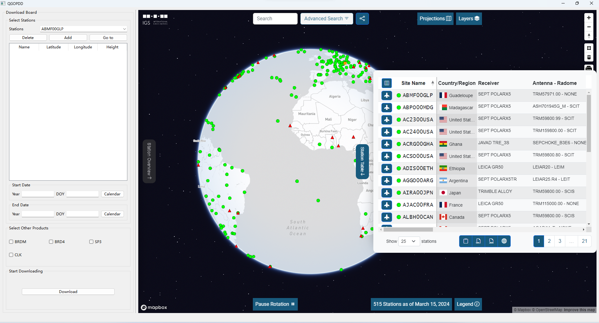

# QGOPDD
A GNSS Observation&amp;Product Data Downloader based on Qt.

## The main idea
Well, I am a student major in Geodesy, and I am interested in GNSS. After trying some GNSS software tool suites, such as RTKLIB, Net_Diff, gLAB and CGO2, I think maybe create a program for downloading GNSS data is a good practice to polish my C/C++ programming skills and enhance my understanding of the subject.
## About
QGOPDD is a GNSS data downloader. It supports to download GNSS observation data through [IGS Data Center of Wuhan University](https://www.igs.gnsswhu.cn) with ftp client for now. Other GNSS data center will be supported later. 
For now, it just supports the download of observation data from a series of IGS stations in a particularly selected day, but does not support the download of data across days. This bug will be fixed soon.
The BRDM, BRD4, CLK, EPH and other products will be supported soon.
## How to use
You can choose the stations you are interested in by checking the [IGS Network](https://network.igs.org) pre-loaded in this software. You can click "Go to" to know where this station exactly is located in, and after you find it, you can click "Add" to add this station to the table widget of waiting for downloading.
After determining the list of downloads, you'll need to select the date of the observation file. However, just as mentioned above, you can just set the start date and the end date as the same. 
Then click download, the Compressed-RINEX-v3(CRX) file will begin downloading and it will just stored in the origin directory of the software. You can use gzip or other uncompress tools to decompress it and you will get a .crx file. To decode the CRX to RINEX, you can use crx2rnx in [RTKLIB](https://www.rtklib.com/).
The complete description of RINEX(Receiver INdependent EXchange) format will be found in [https://files.igs.org/pub/data/format/](https://files.igs.org/pub/data/format/).
## License
QGOPDD is released under the GNU Public License(GPL) version 3. 
## Installing
Binaries for QGOPDD are available at [https://github.com/yhw605/QGOPDD/releases](https://github.com/yhw605/QGOPDD/releases). After decompressing the zip file, you can just run the QGOPDD.exe in Windows. But it has no binary release for Linux right now, but you can compile it in Linux. 
## Compilation
You can just use Qt Creator to compile it, or you can build it with CMake.
It is based on Qt 6.5.3, so you should ensure you have this version or later.
Run the command line behind.
```
git clone https://github.com/yhw605/QGOPDD.git
cd QGOPDD
cmake -DQt6_DIR:PATH=path/to/lib/cmake/Qt6 -DQt6CoreTools_DIR:PATH=path/to/cmake/lib/Qt6CoreTools -DQt6Core_DIR:PATH=path/to/lib/cmake/Qt6Core -DQt6GuiTools_DIR:PATH=path/to/lib/cmake/Qt6GuiTools -DQt6Gui_DIR:PATH=path/to/lib/cmake/Qt6Gui -DQt6Network_DIR:PATH=path/to/lib/cmake/Qt6Network -DQt6Sql_DIR:PATH=path/to/lib/cmake/Qt6Sql -DQt6WebChannel_DIR:PATH=path/to/lib/cmake/Qt6WebChannel -DQt6WebEngineCoreTools_DIR:PATH=path/to/lib/cmake/Qt6WebEngineCoreTools -DQt6WebEngineCore_DIR:PATH=path/to/lib/cmake/Qt6WebEngineCore -DQt6WebEngineWidgets_DIR:PATH=path/to/lib/cmake/Qt6WebEngineWidgets -DQt6WidgetsTools_DIR:PATH=path/to/lib/cmake/Qt6WidgetsTools -DQt6Widgets_DIR:PATH=path/to/lib/cmake/Qt6Widgets -B build
cmake --build build
```
"path/to/..." is the location of those Qt environments, or you can store them to your PC.
And then, you should use windeployqt.exe and copy libcurl.dll to your build dir(I tried and it made sense) or linuxdeployqt(I haven't tried). After that, you can run it successfully!
